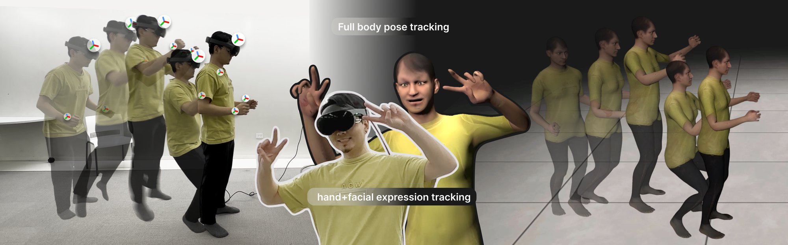
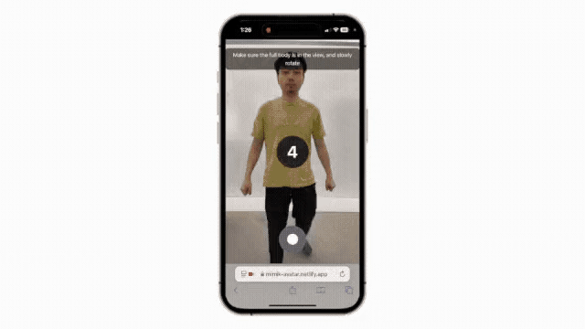

# FlowAvatar

**Real-Time Full-Body Avatars from Sparse Egocentric Inputs on Consumer XR Devices**

Chenfeng Gao\*, Taeyoung Yeon\*, Sungheon Park, Vasco Xu, Anish Prabhu, Mar Gonzalez-Franco, Karan Ahuja
(\* equal contribution)

*IEEE ISMAR 2026 (IEEE Transactions on Visualization and Computer Graphics)*

Paper (coming soon) · [SPICE Lab](https://spice-lab.org/)
<!-- Paper link: replace "Paper (coming soon)" with [Paper](URL) once it is online. -->



FlowAvatar is a unified system for real-time personalized look-alike avatars with
full-body pose, hand articulation, facial expression and eye gaze tracking from sparse
egocentric inputs (head and hands) on consumer XR devices (Meta Quest Pro). A recurrent
pose model predicts the SMPL-X body from the headset and hand tracking, either on a PC
that streams the pose to the headset or directly on the headset.

<p align="center">
  
</p>

## What is in this repository

| Directory | Content | Start here |
|-----------|---------|------------|
| `unity/` | Unity client for Meta Quest: avatar, tracking inputs, streaming and on-device (Unity Sentis) modes | [unity/README.md](unity/README.md) |
| `streaming/` | Python server for the streaming mode: receives the Quest tracking over TCP, streams the predicted pose back | [Streaming demo](#streaming-demo) |
| `avatar-pipeline/` | Personalized avatar from a phone video: UV texture and body shape for the Unity avatar | [avatar-pipeline/README.md](avatar-pipeline/README.md) |
| `training/` | Training and evaluation on AMASS, reproducing the paper's benchmark tables | [training/README.md](training/README.md) |
| `checkpoints/` | Paper (benchmark) and demo (deployment) checkpoints | [checkpoints/README.md](checkpoints/README.md) |
| `flowavatar/` | Shared Python package: network, checkpoint loading, rotation and kinematics utilities | |
| `configs/`, `docs/` | Streaming configuration; [Unity ⇄ Python protocol](docs/streaming_protocol.md) | |

## Streaming demo

The pose model runs on a PC; the Quest sends its tracking and receives the pose.

All commands run from the repository root.

1. **Install** (Python ≥ 3.10, git): `pip install -r requirements.txt`
2. **SMPL-X model:** download the SMPL-X model in NPZ format (v1.1 or v1.0) from the
   [SMPL-X download page](https://smpl-x.is.tue.mpg.de/download.php) (free registration)
   and place `SMPLX_NEUTRAL.npz` (in the zip's `models/smplx/`) at
   `body_models/smplx/SMPLX_NEUTRAL.npz` (or set `SMPLX_MODEL_PATH`).
3. **Run the server** (the checkpoints are in the repository):

   ```bash
   python -m streaming.live_demo --model gru
   ```

   It waits on TCP ports 8888 (tracking in) and 8889 (pose out), exits if no client
   connects within 30 seconds, and serves one session (restart it for the next). Ports,
   model choice and input-feature flags are set in
   [configs/streaming.yaml](configs/streaming.yaml) (`--config` to use another file).
4. **Start the Unity client** on the headset, pointed at this machine's IP
   ([unity/README.md](unity/README.md#streaming-mode)); allow Python through the firewall.

Models: `gru` (default, best accuracy, 60 Hz input) and `lstm` (the on-device model,
30 Hz input: set the Unity client's send rate to 30); both take a 40-frame window.

## On-device mode

The LSTM (30 Hz input, 40-frame window) runs on the headset CPU with Unity Sentis
(Sentis has no GRU operator); no PC is needed. The Unity client ships it as ONNX; see
[unity/README.md](unity/README.md#on-device-mode). To export an LSTM checkpoint:

```bash
pip install onnx onnxruntime
python -m streaming.export_onnx --model_path checkpoints/LSTM/baseline.pt
```

then copy `converted_onnx/flowavatar_sentis_final.onnx` over
`unity/Assets/Scripts/FlowAvatar/OnDevice/Models/flowavatar_lstm.onnx` (keep its `.meta`).

## Personalized avatars

[avatar-pipeline/](avatar-pipeline/README.md) turns a short phone video into a texture in
the Unity avatar's UV layout and its ten SMPL-X shape parameters. It runs offline on a
Linux machine with an NVIDIA GPU.

## Training and evaluation

```bash
python -m training.prepare_data --amass_dir data/AMASS --save_dir data/amass_smplh_60fps --fps 60
python -m training.train --config training/configs/gru_smplh.yaml
python -m training.evaluate --config training/configs/gru_smplh.yaml \
    --checkpoint checkpoints/benchmark/gru_smplh.pt
```

`gru_smplh.yaml` / `lstm_smplh.yaml` train the benchmark models on SMPL+H (comparable
with prior work and the paper tables), `training/configs/ablations/` the loss ablations,
and `gru_smplx.yaml` / `lstm_smplx.yaml` the SMPL-X models of the demos. The released
paper checkpoints reproduce Tables 2 and 3; see [training/README.md](training/README.md)
(body models and AMASS download).

## Citation

Coming soon.

## License

The code is released under the [MIT License](LICENSE). Third-party components keep
their own licenses ([THIRD_PARTY_NOTICES.md](THIRD_PARTY_NOTICES.md)); the SMPL-X,
SMPL+H and SMPL body models, the AMASS dataset and the `human_body_prior` package are
licensed separately by MPI-IS for non-commercial research and are not covered by this
license.
